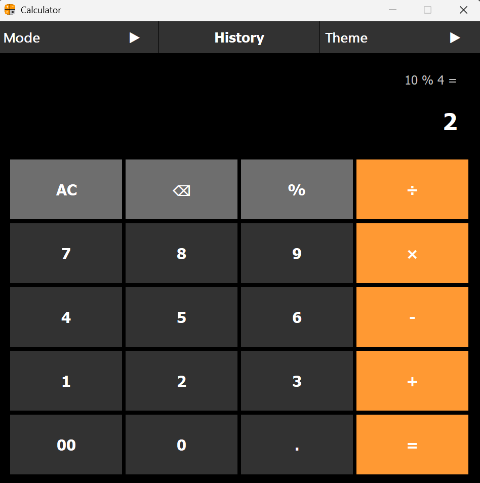
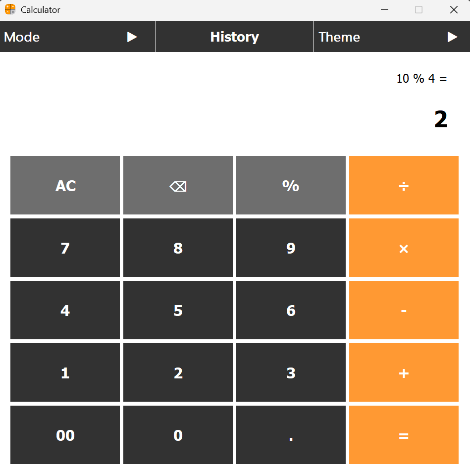
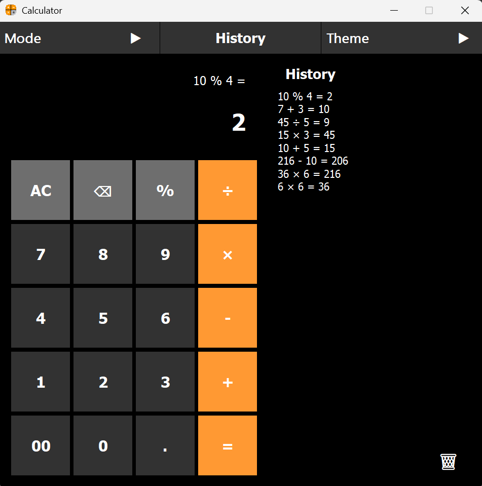
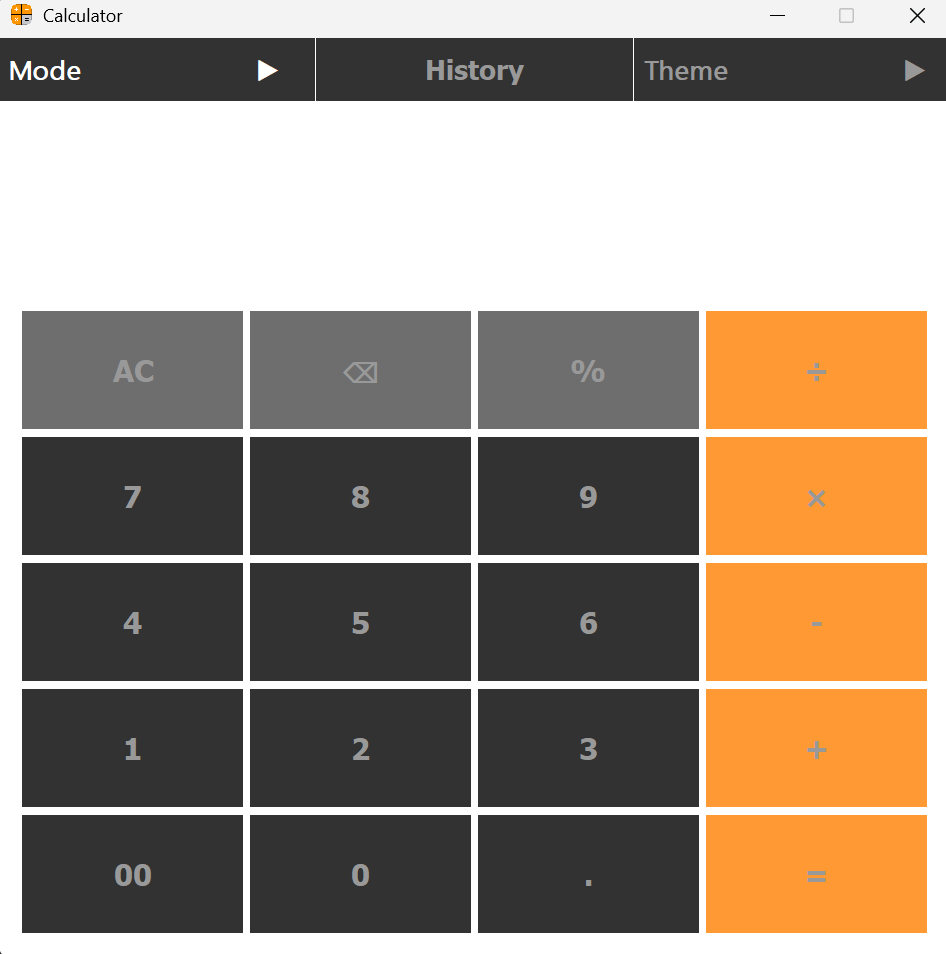

# 🧮 Smart Calculator (Java Swing)


A modern, fully functional desktop calculator built using **Java Swing**.  
This project demonstrates a clean **Object-Oriented Programming (OOP)** architecture with separation of logic, UI, styling, and event handling.

---

## ✨ Features

### ➗ Core Functions
- Basic arithmetic operations: `+`, `-`, `×`, `÷`, `%`
- Decimal number support
- Backspace (⌫)
- Clear All (AC)
- ON / OFF system to enable/disable calculator

---

## 🧩 Project Components

The application is built using modular UI components to ensure clean structure and scalability:

### 📌 Menu Bar
- Provides quick access to:
  - 🎨 Theme switching (Dark / Light)
  - 📜 History management
  - ⚡ Application control (ON / OFF)

### 📜 History Panel
- Displays all previous calculations
- Uses Stack-based storage (LIFO)
- Shows latest operations first
- Includes clear history option

### 🎨 Theme System
- Supports Dark Mode (default)
- Supports Light Mode
- Dynamically updates:
  - Panels
  - Text fields
  - History UI

### 🔢 Calculator Keypad
- Grid-based button layout
- Supports:
  - Numbers
  - Operators (+ - × ÷ %)
  - AC / Backspace / Equals
- Hover effects for better UX

---

### 🔗 Smart Chaining
- Continuous calculations without pressing `=`
- Previous result automatically becomes the next operand
- Supports operator chaining naturally

---

### 📜 History System (Stack-Based)
- Stores all operations using **Stack (LIFO)**
- Saves full expressions with results
- Displays newest history first
- Clear history option

---

### 🎨 UI & Themes

- Dark Mode (default)
- Light Mode support
- Smooth hover effects
- Clean mobile-style calculator UI

## 🖼️ Preview

<p align="center">
  
  
</p>

<p align="center">
  <b>Dark Mode</b> &nbsp;&nbsp;&nbsp;&nbsp;&nbsp;&nbsp;&nbsp;&nbsp;&nbsp;
  <b>Light Mode</b>
</p>

<br>

<p align="center">
  
  
</p>

<p align="center">
  <b>History Panel</b> &nbsp;&nbsp;&nbsp;&nbsp;&nbsp;&nbsp;&nbsp;
  <b>OFF Mode</b>
</p>

---

## 🎛️ Buttons & Styling

- **Modern Button Design:**
  - Rounded buttons inspired by iOS design
  - Clean spacing and consistent sizing

- **Interactive Feedback:**
  - Smooth hover effects for better user experience
  - Visual response on button click

- **Color System:**
  - Distinct colors for operators and numbers
  - Clear visual hierarchy for better usability

- **Typography:**
  - Readable font with proper sizing
  - Dynamic formatting for large numbers

- **Layout Consistency:**
  - Grid-based button alignment
  - Balanced spacing between elements
 
- Subtle shadows and depth effects for a modern UI feel

---

## 🏗️ Project Structure

- CalculatorLogic → Handles all math operations  
- CalculatorHandler → Manages events & chaining logic  
- Frame → Builds GUI layout  
- HistoryManager → Stack-based history system  
- CalculatorStyle → UI styling & effects  

---

## 📌 Example Usage
```6 × 6 = 36```
```36 × 6 = 216```
```216 - 10 = 206```

```10 + 5 = 15```
```15 × 3 = 45```
```45 ÷ 5 = 9```

```7 + 3 = 10```
```10 % 4 = 2```

---

## 💡 Key Highlights
- Clean OOP design
- Modular architecture
- Real-time calculation
- Stack-based history system
- Modern UI with theme switching

---

## 🛠️ Technologies Used
- Java
- Java Swing (GUI)
- AWT (Events)
- Stack Data Structure

---

## ⭐ Note

This project combines:

iOS-style modern UI
Windows-style calculator behavior
Scalable clean architecture

---

## 👩‍💻 Developed By

Designed and implemented to strengthen skills in:

- Object-Oriented Programming (OOP)
- Java Swing GUI Development
- Event-Driven Architecture
- Data Structures (Stack)

With a focus on writing clean, modular, and scalable code.

---

## 🚀 How to Run

```bash
git clone https://github.com/yourusername/SmartCalculator.git
